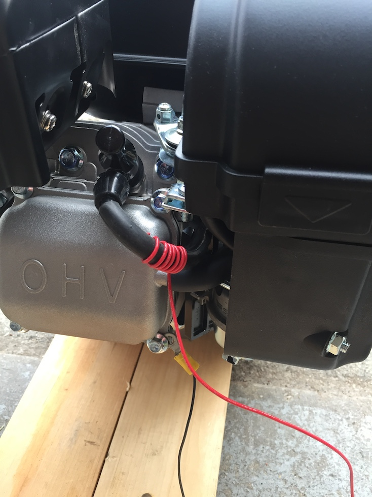
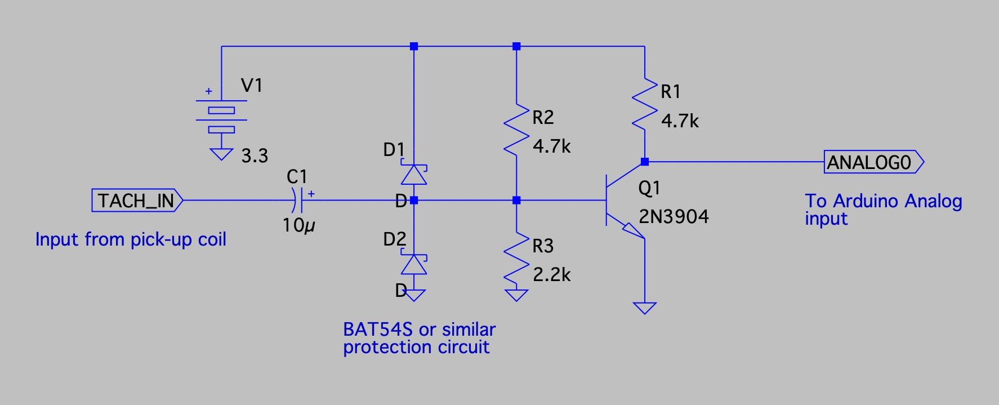

Tachometer
==========

An Arduino program for a simple Go Kart engine tachometer.  Analog input comes from a capacitive pick-up on the spark plug wire (one cylinder engine). DSP
is used to convert the analog signal to a tach readout.

Maximum reading is 128 RPS, or 7,680 RPM.

This has been tested successfully on a Predator 212cc go kart engine. 

Hardware Design
===============

The goal is to have a simple, non-invasive connection to the engine.  We take advantage of the fact that a high voltage signal exists on the spark-plug 
wire which can be sensed using a capacitive pickup made form a coil wrapped
around the spark wire.  This signal can be amplified and sent to an 
analog input on an Arduino (or similar ADC) for signal processing.

Here's what our pickup looks like:

And here is a rough example of what the amplifier looks like.

Software Notes
==============

The signal obtained through the connection above is extremely noisy. 
Take a look with an oscilloscope to see what I mean.  However, 
when building a tachometer we
are only trying to recover a single piece of information from that
signal which is **the dominant frequency**.  For this task, we rely on a
fundamental tool from digital signal processing called the discrete Fourier 
Transform (DFT).  

License
=======

This program is free software: you can redistribute it and/or modify
it under the terms of the GNU General Public License as published by
the Free Software Foundation, either version 3 of the License, or
(at your option) any later version.

This program is distributed in the hope that it will be useful,
but WITHOUT ANY WARRANTY; without even the implied warranty of
MERCHANTABILITY or FITNESS FOR A PARTICULAR PURPOSE.  See the
GNU General Public License for more details.

You should have received a copy of the GNU General Public License
along with this program.  If not, see <https://www.gnu.org/licenses/>.

NOT FOR COMMERCIAL USE WITHOUT PERMISSION.